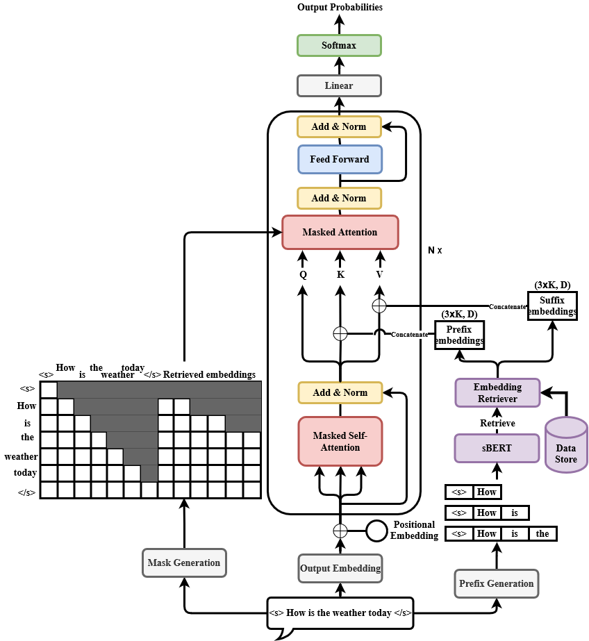

# Expanding SUffix REtrieval-Augmented Language Modeling (SUREALM) on Domain Adaptation and Controllable Generation, Oct. 2022 - present. 
We continue to work on [SUREALM](https://arxiv.org/abs/2211.03053) on its potential for domain adaptation and generation controllability. We are investigating if controlling the external knowledge bases can result in robust transferability between domains with factually correct generation.\
[[code]](https://github.com/Victor-wang-902/SUREALM)

# Simultaneous Machine Translation with Deep Reinforcement Learning, June 2022 - present.
We aim to derive a learning algorithm for latency control policy in simultaneous machine translation contexts using reinforcement learning.

# AI for Scientific Research: Bio-treatment, March 2022 - present.
Predict vaccination response of patients using machine learning algorithms. A comprehensive pipeline including data pre-processing, feature engineering, cross validation, training, and evaluation is designed and implemented to provide the collaborator working in Bio-medicine with highly flexible and accessible tools with simple interfaces. Code is yet to be publicized.

# Object Detection with Self-Supervised Pre-training, March - May 2022.
Course project for [CSCI-GA - 2572 Deep Learning](https://atcold.github.io/pytorch-Deep-Learning/). In this project we used popular SSL methods for pretraining of ResNet-50 as well as Transformer architectures (DETR) and then finetuned detection heads on labeled dataset achieving reasonable performance (ranked top 3 in our class!).\
[[report]]()[[code]](https://github.com/Victor-wang-902/csci-ga-2572-final-project)

# Q&A Dialog System for Information Inquiry based on Similarity between Sentence Representations, Jan. - March 2022.
Preliminary project fine-tuning sentence transformers on augmented data from limited templates. We used sentence transformer in a simple retrieval system to achieve inqury answering on faculty information of NYU Shanghai.\
[[code]](https://github.com/Victor-wang-902/prof_qa)

